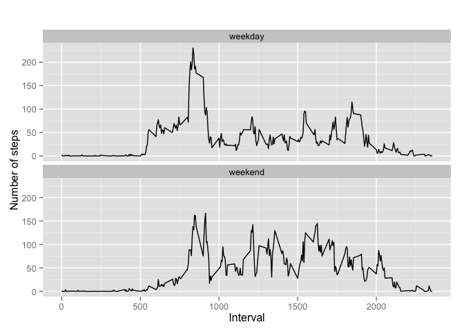

# Reproducible Research Course Project 1

#### Step 1. Loading and preprocessing the data


```r
act.df <- read.csv("activity.csv",header = TRUE, na.strings = "NA",stringsAsFactors = FALSE)
```

#### Step 2. What is mean total number of steps taken per day?
1. Make a histogram of the total number of steps taken each day 


```r
# Clean up NAs and calculate sum of steps per day
act.sum.df <- aggregate(steps ~ date, data = act.df, sum,na.action = na.omit)

# Histogram of the total number of steps taken each day
hist(act.sum.df$steps, main="Histogram of total number of steps per day", xlab="Total number of steps per day")
```

 
2. Calculate and report the mean and median total number of steps taken per day


```r
# Mean of the total number of steps taken per day
mean(act.sum.df$steps)
```

```
## [1] 10766.19
```

```r
# Median of the total number of steps taken per day
median(act.sum.df$steps)
```

```
## [1] 10765
```
*So the mean and median of the total number of steps taken per day are 1.0766\times 10^{4} and 10765 respectively*

#### Step 3. What is the average daily activity pattern?
1. Make a time series plot (i.e. type = “l”) of the 5-minute interval (x-axis) and the average number of steps taken, averaged across all days (y-axis).


```r
# aggregate steps as interval to get average number of steps in an interval across all days
act.clean.df <- act.df[complete.cases(act.df),]
act.int.df <- aggregate(steps ~ interval, act.clean.df , mean)

# generate the line plot of the 5-minute interval (x-axis) and the average number of 
# steps taken, averaged across all days (y-axis)
plot(act.int.df$interval, act.int.df$steps, type='l', col=1, 
     main="Average number of steps averaged over all days", xlab="Interval", 
     ylab="Average number of steps")
```

 

2. Which 5-minute interval, on average across all the days in the dataset, contains the maximum number of steps?


```r
# find row id of maximum average number of steps in an interval
max.avg.steps.df<- which.max(act.int.df$steps)

# get the interval with maximum average number of steps in an interval
act.int.df [max.avg.steps.df, ]
```

```
##     interval    steps
## 104      835 206.1698
```

### Step 4. Imputing missing values

1. Calculate and report the total number of missing values in the dataset (i.e. the total number of rows with NAs).


```r
# get rows with NA's
df.NA <- act.df[!complete.cases(act.df),]

# number of rows
nrow(df.NA)
```

```
## [1] 2304
```
2. Devise a strategy for filling in all of the missing values in the dataset. The strategy does not need to be sophisticated. For example, you could use the mean/median for that day, or the mean for that 5-minute interval, etc.

3. Create a new dataset that is equal to the original dataset but with the missing data filled in


```r
# perform the imputation
for (i in 1:nrow(act.df)){
  if (is.na(act.df$steps[i])){
    interval_val <- act.df$interval[i]
    row_id <- which(act.int.df$interval == interval_val)
    steps_val <- act.int.df$steps[row_id]
    act.df$steps[i] <- steps_val
  }
}

# aggregate steps as per date to get total number of steps in a day
table_date_steps_imputed <- aggregate(steps ~ date, act.df, sum)

# create histogram of total number of steps in a day
hist(table_date_steps_imputed$steps,  main="(Imputed) Histogram of total number of steps per day", xlab="Total number of steps in a day")
```

 

4. Make a histogram of the total number of steps taken each day and Calculate and report the mean and median total number of steps taken per day. Do these values differ from the estimates from the first part of the assignment? What is the impact of imputing missing data on the estimates of the total daily number of steps?

```r
# get mean and median of total number of steps per day
mean(table_date_steps_imputed$steps)
```

```
## [1] 10766.19
```


```r
# get mean and median of total number of steps per day
median(table_date_steps_imputed$steps)
```

```
## [1] 10766.19
```


```r
# Mean of the total number of steps taken per day
mean(act.sum.df$steps)
```

```
## [1] 10766.19
```

```r
# Median of the total number of steps taken per day
median(act.sum.df$steps)
```

```
## [1] 10765
```

*Due to data imputation, the means remain same whereas there is slight change in median value.*

### Step 5. Are there differences in activity patterns between weekdays and weekends?

1. Create a new factor variable in the dataset with two levels – “weekday” and “weekend” indicating whether a given date is a weekday or weekend day.


```r
# convert date from string to Date class
act.df$date <- as.Date(act.df$date)

# add a new column indicating day of the week 
act.df$day <- weekdays(act.df$date)

# add a new column called day type and initialize to weekday
act.df$day_type <- c("weekday")

# If day is Saturday or Sunday, make day_type as weekend
for (i in 1:nrow(act.df)){
  if (act.df$day[i] == "Saturday" || act.df$day[i] == "Sunday"){
    act.df$day_type[i] <- "weekend"
  }
}

# convert day_time from character to factor
act.df$day_type <- as.factor(act.df$day_type)

# aggregate steps as interval to get average number of steps in an interval across all days
table_interval_steps_imputed <- aggregate(steps ~ interval+day_type, act.df, mean)
```

2. Make a panel plot containing a time series plot (i.e. type = “l”) of the 5-minute interval (x-axis) and the average number of steps taken, averaged across all weekday days or weekend days (y-axis).


```r
# make the panel plot for weekdays and weekends
library(ggplot2)
qplot(interval, steps, data=table_interval_steps_imputed, geom=c("line"), xlab="Interval", ylab="Number of steps", main="") + facet_wrap(~ day_type, ncol=1)
```

 
